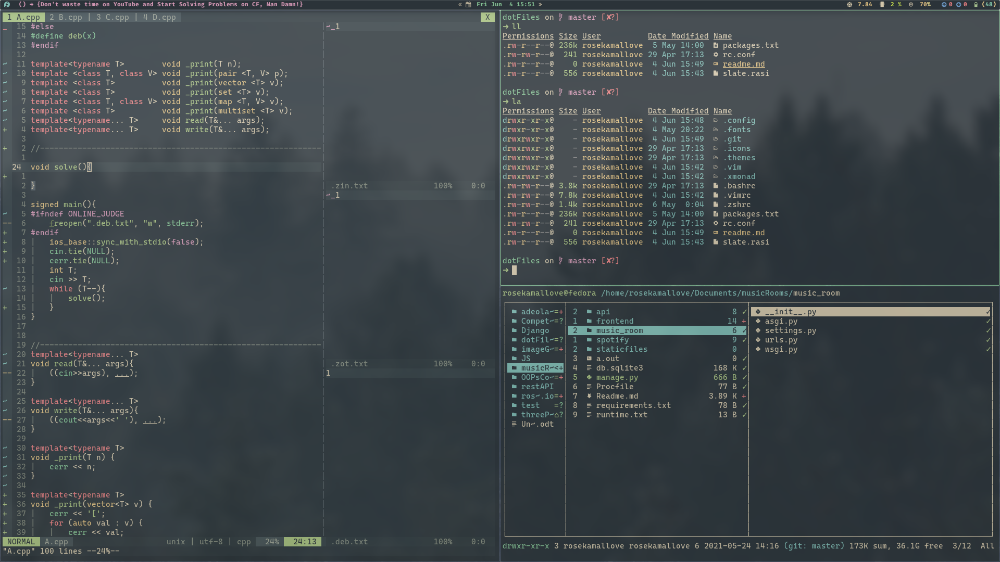

# This is my setup:

- ## Software I Use:
  -  [Xmonad](https://xmonad.org/) as my tiling window manager and [Xmobar](https://xmobar.org/#:~:text=Xmobar%20is%20a%20minimalistic%20status%20bar.&text=Xmobar%20was%20inspired%20by%20the,templates%2C%20and%20extensibility%20through%20plugins.) as my panel.
  - [Vim](https://github.com/vim/vim) as my main text editor.
  - [Ranger](https://github.com/ranger/ranger) as my file explorer.
  - [Alacritty](https://github.com/alacritty/alacritty) as my terminal emulator.
  - [EverForest](https://github.com/sainnhe/everforest) as my colorScheme.
  - [ZSH](https://www.zsh.org/) as my shell.
  - [LSD](https://github.com/Peltoche/lsd) instead of ls.
  - [Picom](https://github.com/yshui/picom) as my compositor.
  - [Rofi](https://github.com/davatorium/rofi) as my application launcher.